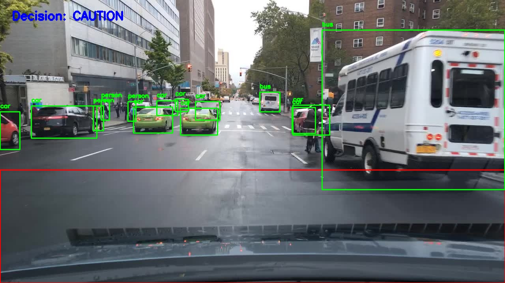
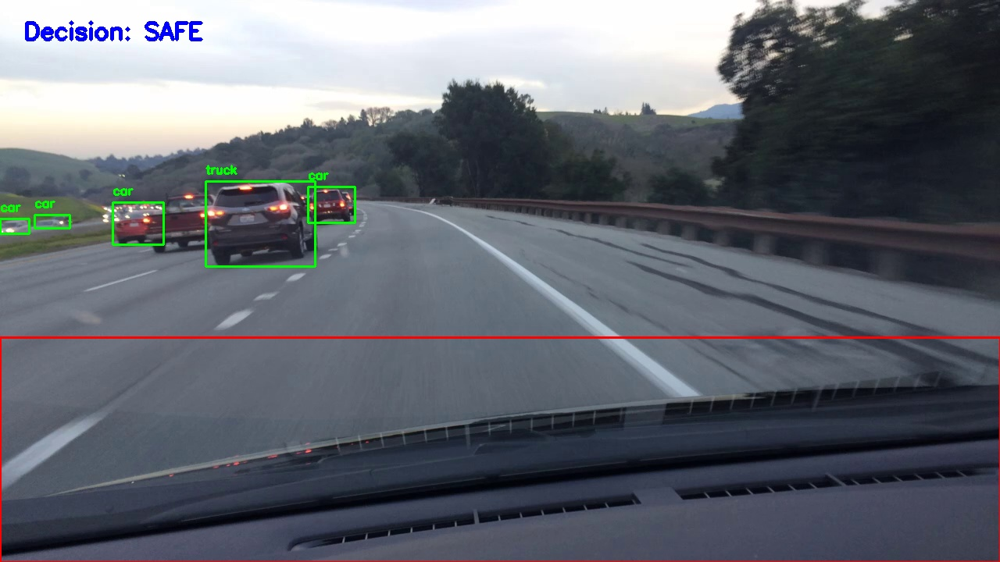
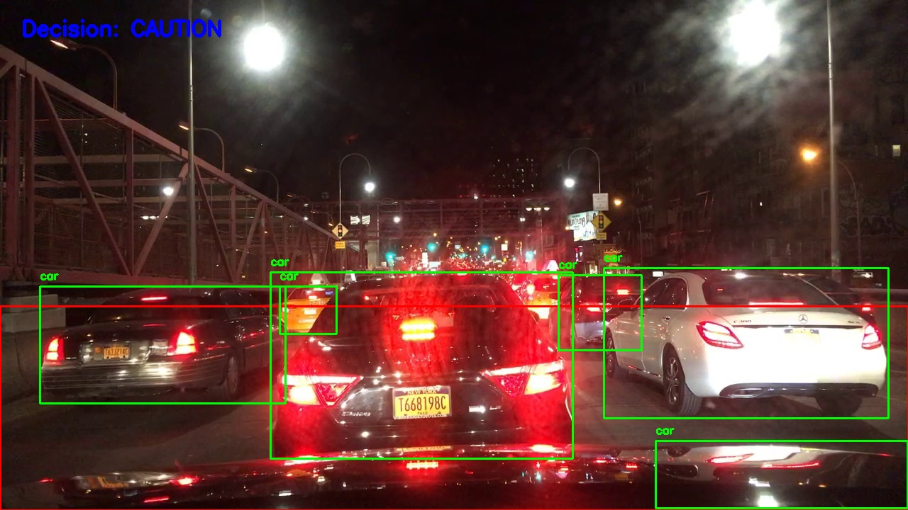

# Hybrid Perception for Semantic Navigation

Hybrid Perception System using YOLO and Vision-Language Models (LLaVA)

## Overview

This project implements a hybrid perception system for autonomous ground navigation by combining:

- **Structured object detection** using YOLOv8
- **Semantic reasoning** using a Vision-Language Model (LLaVA via Ollama)
- A rule-based fusion layer for decision-making

The system evaluates urban driving scenes (BDD100K dataset) and produces navigation-oriented decisions:

- SAFE
- CAUTION
- STOP

The objective is not to replace object detection with a VLM, but to explore how structured perception and semantic reasoning can complement each other in robotics applications.

---

## Technologies
- OpenCV
- YOLO
- Ollama (Llava:7b model)

---


## System Architecture
### Pipeline:

Input Image → YOLOv8 Object Detection → LLaVA Scene Reasoning → Fusion Logic → Navigation Decision

### 1. Object Detection (YOLOv8n)

- YOLO without fine-tuning performed
- Filters navigation-relevant classes:
  - person
  - car
  - truck
  - bus
  - motorcycle
  - bicycle

Outputs:
- Bounding boxes
- Class labels
- Confidence scores
- Inference latency


### 2. Vision-Language Reasoning (LLaVA via Ollama)

The VLM is prompted as a perception module for a mobile robot.

Example prompt:

        You are a perception module for a mobile ground robot.

        Analyze the image and answer:

        1. Is it safe to move forward?
        2. Are there pedestrians directly ahead?
        3. Are there obstacles or cars blocking the path?

        Respond strictly in this format:

        Decision: SAFE / CAUTION / STOP
        Reason: <short explanation>

Outputs:
- Semantic decision
- Inference latency


### 3. Fusion Logic

A rule-based module combines:

- Spatial analysis of detected bounding boxes
- VLM semantic output

Decision strategy:

- Person in critical region → STOP
- Large object in lower-central region → CAUTION
- No relevant obstacle → SAFE

This allows structured perception to dominate safety-critical decisions, while the VLM provides contextual reinforcement.


---


## Example Outputs

<p align="center">
  YOLO detection examples
</p>

<p align="center">
  
  
</p>

<p align="center">
  
  
</p>


<p align="center">
  Logs and metrics
</p>

The system logs structured outputs in JSON format:
<p align="center">
  Output for the second image (results/output2.jpg)
</p>


  ```json
  {
      "detections": [
          {
              "class": "bus",
              "confidence": 0.874072253704071,
              "bbox": [
                  816.0758666992188,
                  76.48983764648438,
                  1279.720458984375,
                  482.8736877441406
              ]
          },
          {
              "class": "car",
              "confidence": 0.8737229704856873,
              "bbox": [
                  338.97894287109375,
                  272.3184814453125,
                  437.07781982421875,
                  338.7615966796875
              ]
          },
          {
              "class": "person",
              "confidence": 0.4818313717842102,
              "bbox": [
                  236.75973510742188,
                  269.21978759765625,
                  262.8940734863281,
                  332.93072509765625
              ]
          },
  
                  ...........
                 
          {
              "class": "bus",
              "confidence": 0.31736987829208374,
              "bbox": [
                  658.5709838867188,
                  234.48065185546875,
                  709.9684448242188,
                  284.00299072265625
              ]
          }
      ],
      "vlm_response": " Decision: SAFE\nReason: The image appears to show a clear road with no pedestrians directly ahead or obstacles blocking the path. There is a vehicle that seems to be moving forward, indicating traffic flow. It's safe for your robot to move forward under these conditions. ",
      "rule_decision": "CAUTION",
      "yolo_time": 0.08684563636779785,
      "vlm_time": 3.1153104305267334
  }
```

---

## Results
- YOLO provides more reliable, low-latency structured detections.
- LLaVA adds contextual interpretation but introduces significantly higher latency.

---

## Performance Snapshot

For the example seen before:

| Module | Avg Latency |
|--------|------------|
| YOLOv8n | ~80 ms |
| LLaVA (7B) | ~3.1 s |

The VLM is ~40x slower than YOLO inference. This value depends on the image selected


## Dataset

Although the system is dataset-agnostic, urban road scenes are particularly relevant for evaluating navigation safety reasoning.

I used the following dataset:
- BDD100K: https://bair.berkeley.edu/blog/2018/05/30/bdd/


## Future Work
